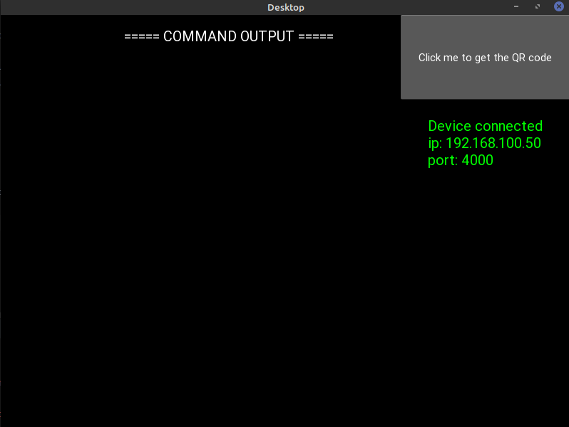
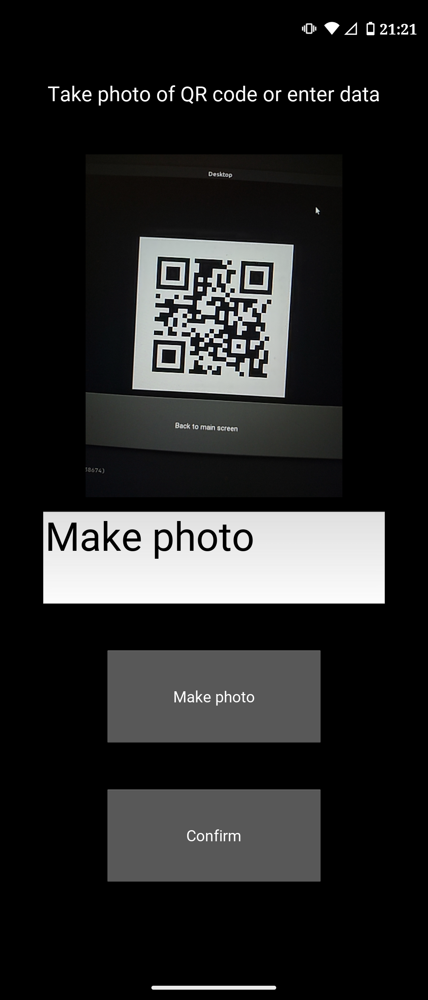
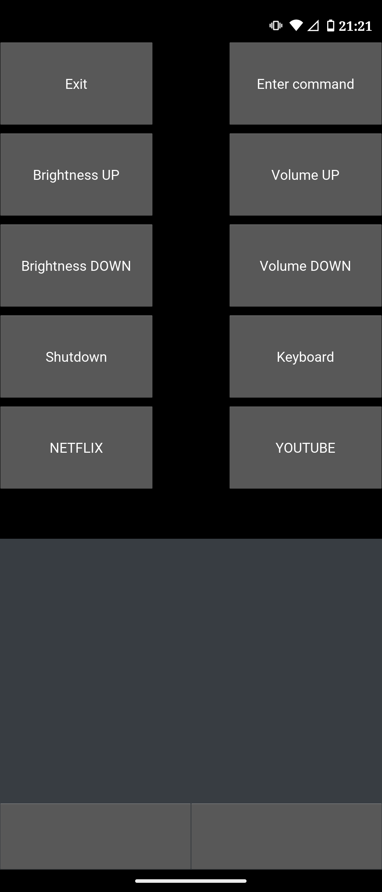

# Remote Control

This is remote control of your computer, which you can install on your mobile phone. This project was created for python course at AGH UST in 2021.

## Description

This project consists two parts. First part is app on computer.
This app generates qr code and create server to connect by mobile phone.

Second part is mobile app. This app allows to connect with computer by wi-fi and control that. 
We connect by scan a QR code on mobile phone.

#### Functionalities:

1. Enter some command.
2. Control volume and brightness of screen.
3. Shutdown the computer.
4. Open on-screen keyboard.
5. Open some sites by one click (e.g. Youtube, Netflix).
6. Control cursor.

## Technologies

The app was written in python. We used kivy module to create GUI and twisted module to connect devices. We used buildozer module to create android app.

## How to use

You have to install compressed version app [android_app/release/rc-1.5-armeabi-v7a-debug.apk](https://github.com/gregori0o/python-project/tree/main/android_app/release/rc-1.5-armeabi-v7a-debug.apk) on your mobile phone.

Next step is run server on your computer. You have to clone this repository and run [desktop/app/main.py](https://github.com/gregori0o/python-project/blob/main/desktop/app/main.py).
To run this code you need modules:
* Kivy
* qrcode
* twisted
* pynput
* image

After ran you must click button to generate QR code. You must scan this QR by mobile app and make connection.

  

Created by: [@gregori0o](https://github.com/gregori0o) and [@kkafar](https://github.com/kkafar)